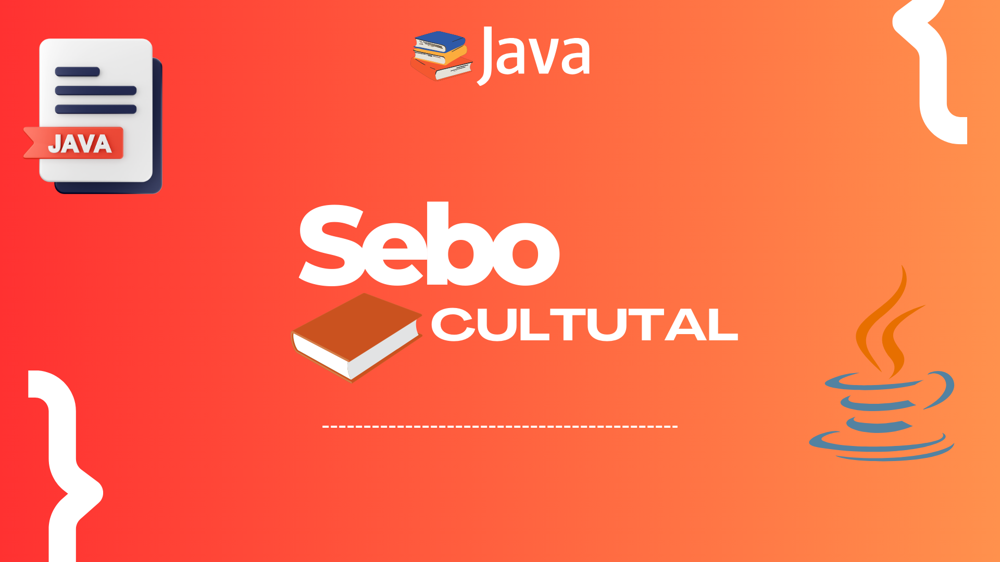

<h1 align="center">
  Sebo Cultural
</h1>

  
  
  
  
  

  
  
  

  

### 📚 Descrição do Projeto

O **Sebo Cultural** é um sistema simples de gerenciamento para uma loja de livros usados. Este projeto foi desenvolvido em Java, utilizando conceitos de programação orientada a objetos (POO).

#### 🔍 Funcionalidades

- `Cadastro de Livros:` Adicione informações sobre os livros disponíveis, como título, autor, ano de publicação, etc.
- `Controle de Estoque:` Acompanhe o estoque de livros e revistas no sistema.
- `Controle de Clientes:` Acompanha a quantidade de usuários no sistema.
- `Relatórios:` Gere relatórios sobre estoque atual, etc.

#### 📦 Pré-requisitos

- `Java JDK 8 ou superior`
- `IDE Java` _(recomendado: IntelliJ, Eclipse, NetBeans)_

#### 💻 Configuração do Ambiente

1. _Clone o repositório:_ `git clone https://github.com/seu-usuario/sebo-cultural.git`
2. _Abra o projeto na sua IDE preferida._
3. _Execute a aplicação._

#### 📁 Estrutura do Projeto

- `src/`_: Contém os arquivos fonte do projeto._
- `docs/`: _Documentação adicional._

#### ⚙️ Uso

1. _Execute a aplicação._
2. _Utilize a interface de linha de comando para interagir com o sistema._
3. _Explore as funcionalidades de cadastro, venda e geração de relatórios._

#### 🚀 Tecnologia

- [GitHub](https://github.com)
- [Git](https://git-scm.com)

#### ✔️ Técnicas utilizadas

- `Paradigma de orientação a objetos`
- `Diagrama de caso de uso`
  - link do projeto [aqui](https://www.figma.com/file/RJdshbairDs82Bg46VxcsG/Casos-de-uso---Sebo-Cultural?type=whiteboard&t=0vZjyDejAARtH5r3-1)
- `Diagrama de classe`
  - link do projeto [aqui](https://www.figma.com/file/2HefYn9U7rPynaIeTA3kQ5/Diagrama-de-Classes---Sebo-Cultural?type=whiteboard&t=0vZjyDejAARtH5r3-1)

#### 📥 Acesso ao projeto

Você pode acessar os arquivos do projeto clicando [aqui](https://github.com/clasSeven7/sebo-cultural).

#### 📍 Contribuição

Contribuições são bem-vindas! Se encontrar algum problema ou tiver sugestões, abra uma issue ou envie um pull request.

#### 📝 Licença

Este projeto está sob a licença [MIT](LICENSE).
